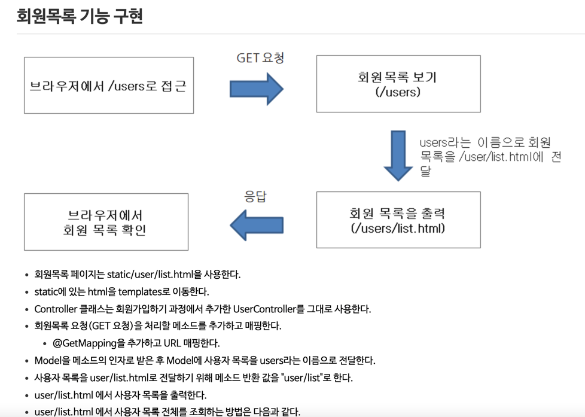
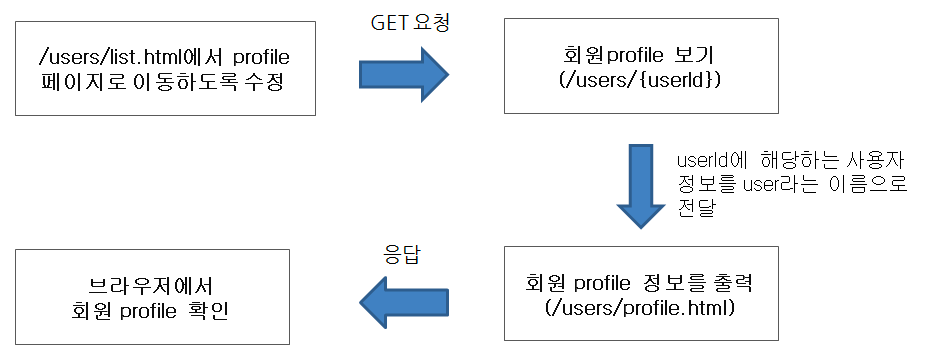
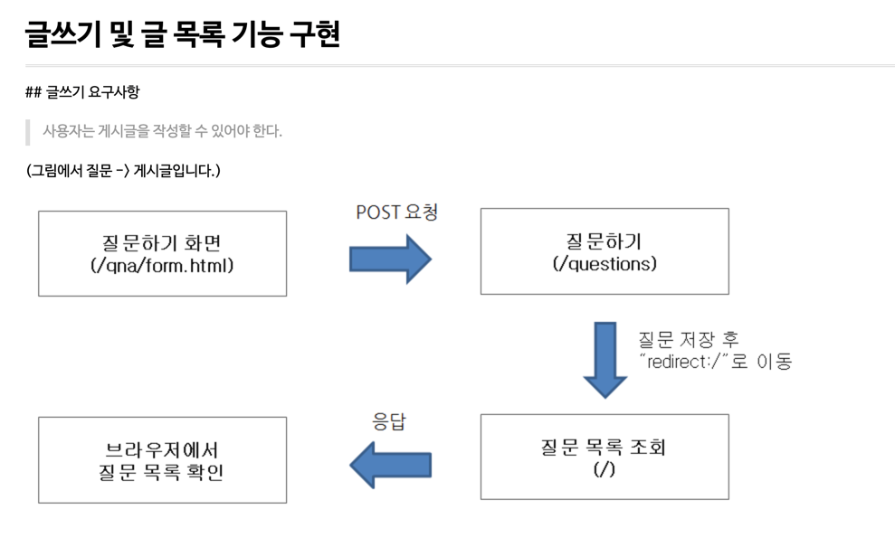
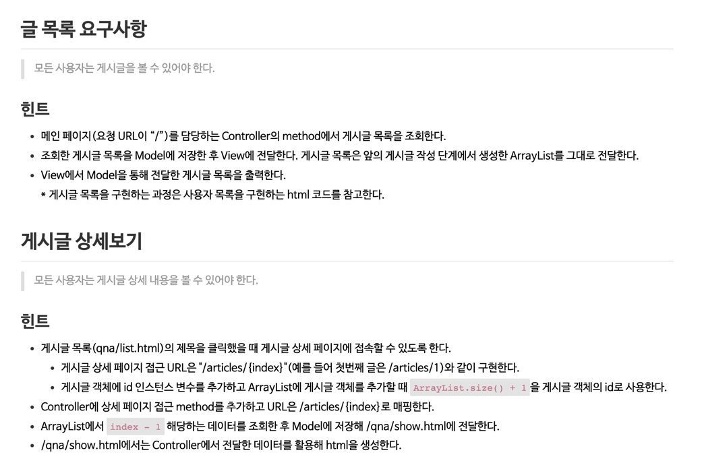
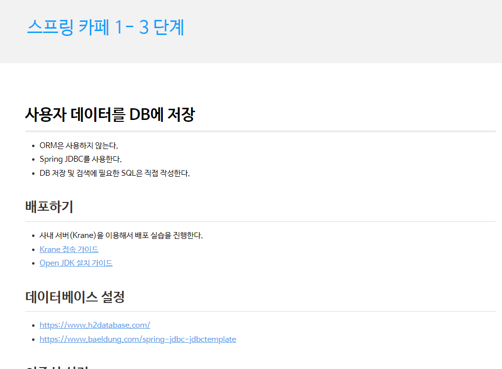
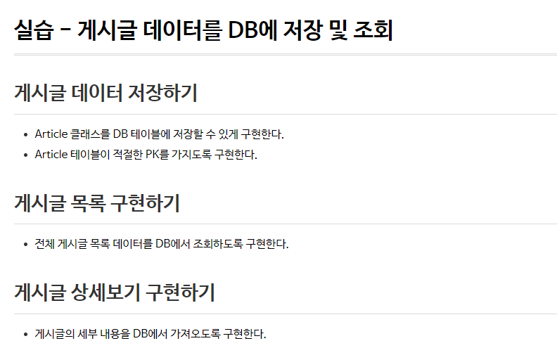
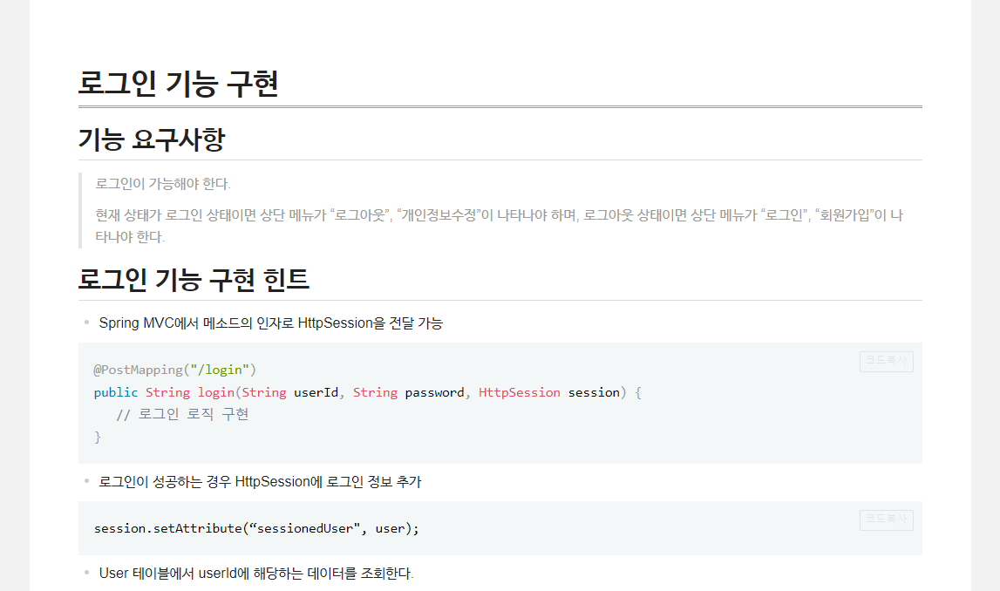
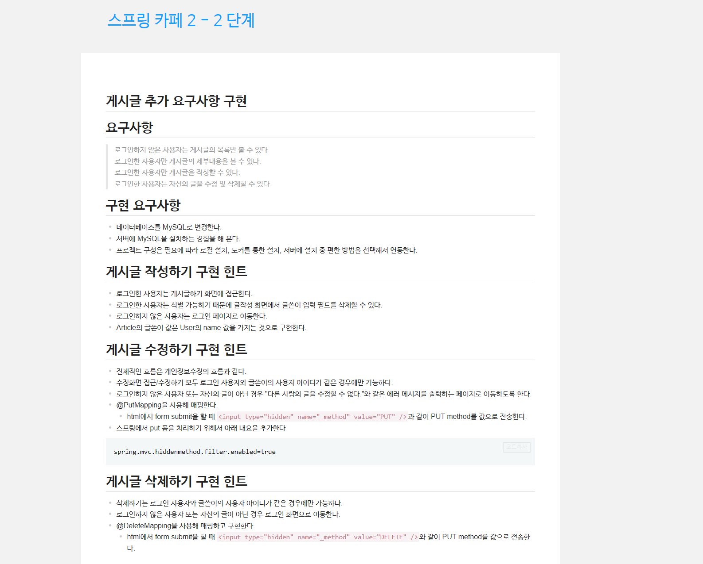

# be-w34-spring-cafe

# step1
## 요구사항
- 회원가입 기능 구현
- 회원목록 기능 구현
- 회원프로필 조회 기능 구현
- 
- 
- 

## 구현내용
- domain 에 User 및 UserList 객체 생성.
- UserList 는 일급 컬랙션으로 생성.
- UserList 는 singleton 패턴으로 생성.
- id,email 에서의 Exception 처리.
- mustache 를 이용하여 java List 를 templates 페이지에서 동적으로 출력.
- User, UserList 객체에 Test 실행.

# step2
## 요구사항
- 글쓰기 및 글 목록 기능 구현.
- 글 목록을 index 페이지에서 볼 수 있도록 구현.
- 게시글 상세보기 페이지 구현.
- 
- 

## 구현내용
- getUserList getCopiedUserList 로 변경
- domain Article 및 ArticleList 객체 생성.
- ArticleList 일급 컬랙션으로 생성.
- ArticleList singleton 패턴으로 생성.
- mustache -> handlebar templates engine 변경하여 list 번호 동적으로 출력.
- lombok 적용.
- Article, Article 객체에 Test 실행.
- mustache partial 이용하여 html 페이지 중복제거.

# step3
## 요구사항
- h2 db 연동.
- Spring JDBC를 사용.
  - 사용자 데이터를 DB에 저장하고 DB에서 조회.
  - 게시글 데이터를 DB에 저장하고 DB에서 조회.
- 
- 

## 구현내용
- DAO 클래스를 생성하여 DB 관련 쿼리를 통해 Create, Read 로직 생성.
  - Read 의 경우, 전체 조회 및 ID로 조회 로직 2개 생성.
- DTO 클래스를 생성하여 Controller 에 도메인 객체가 아닌 DTO 객체를 반환.
- MvcConfig 파일을 이용하여 정적 리소스를 관리하도록 수정.
- @Slfj4 이용하여 log 출력코드 간소화.
- User 와 Article 의 고유 id index 값은 Service Layer 에서 static 변수가 관리하도록 처리.
- 생성자 대신 정적 팩토리 메소드를 이용.
- Article,user의 id 값은 db의 auto increment 를 이용하여 생성한 값을 사용.
- 아이디가 이미 존재 할 경우, Exception 을 이용하여 http 메세지로 이미 존재함을 알림.

# step 2-1
## 요구사항
- 로그인 기능을 구현.
- 로그인 성공시 HttpSession 에 로그인 정보 추가.
- 현재 상태가 로그인 상태이면 상단 메뉴가 “로그아웃”, “개인정보수정”이 나타나고,
  로그아웃 상태이면 상단 메뉴가 “로그인”, “회원가입”이 나타나도록 수정.
- 

## 구현내용
- 로그인이 성공하는 경우 HttpSession에 로그인 정보 추가.
- MvcConfig 파일 이용하여 정적 리소스 관리하도록 수정.
- handlebars 에서 세션에 따른 if/else 구문 추가.
- 생성자 overload 대신 정적 팩토리 메소스 사용.
- lombok 의 builder 사용.
- 회원가입 시 아이디가 중복 될 경우, Exception 발생시키는 코드 생성.
- auto increment 사용, primary 키 지정

# step 2-2
## 요구사항
- 로그인하지 않은 사용자는 게시글의 목록만 볼 수 있도록 변경.
- 게시글의 세부내용은 로그인한 사용자만 볼 수 있도록 변경.
- 로그인하지 않은 사용자는 게시글을 작정 할 수 있도록 변경.
- 로그인한 사용자는 자신의 게시글을 수정 및 삭제 할 수 있도록 변경.
- 데이터 베이스를 MySQL로 변경.
- 

##