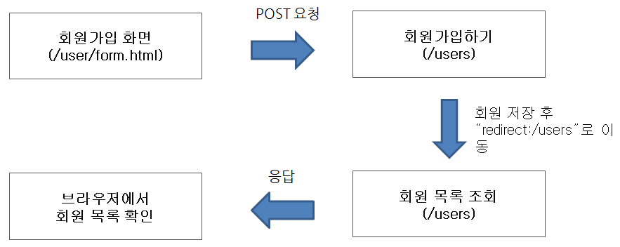
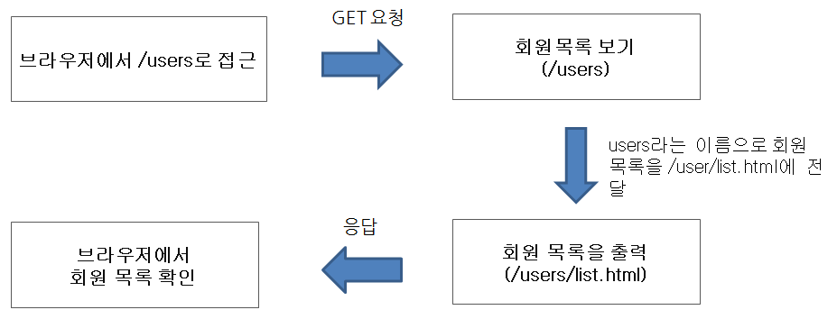
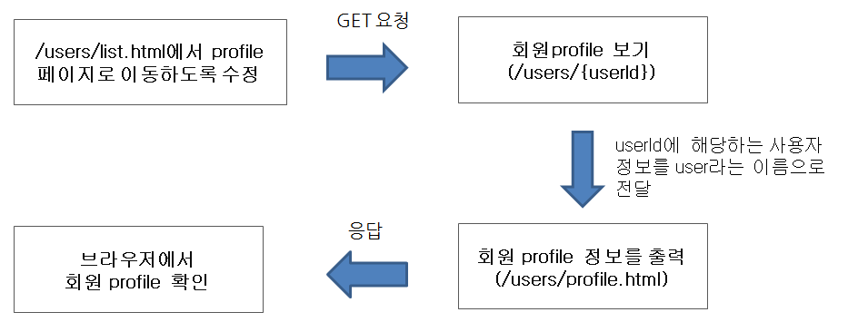
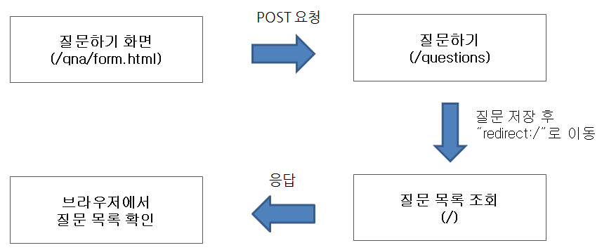

# be-w34-spring-cafe

[참고자료](https://lucas.codesquad.kr/2022-kakao/course/%EC%9B%B9%EB%B0%B1%EC%97%94%EB%93%9C/Kakao-Cafe)

### 📌 회원가입 기능 구현

### 📌 회원목록 기능 구현

### 📌 회원 프로필 조회

### 📌 글쓰기 및 글 목록 기능 구현

(그림에서 `질문`을 `게시글`로 변경)

### 📌 사용자 데이터를 DB에 저장
- ORM은 사용하지 않는다.
- Spring JDBC를 사용한다.
- DB 저장 및 검색에 필요한 SQL은 직접 작성한다.

### 📌 로그인 기능 구현
- 로그인이 가능해야 한다.
- 로그인 상태에 따라 상단 메뉴를 다르게 보여줘야 한다.
    - 로그인 상태 -> 상단 메뉴 `로그아웃`
    - 로그아웃 상태 -> 상단 메뉴가 `로그인`, `회원가입`

### 📌 URL Convention

| url                 | 기능                  |
|---------------------|---------------------|
| `GET` /users        | List all users      |
| `POST` /users       | Create a new user   |
| `GET` /users/form   | Get a register form |
| `GET` /users/:id    | Get a user profile  |
| `GET` /users/login  | Get a login form    |
| `POST` /users/login | Login               |
| `GET` /users/logout | Logout              |
| `GET` /posts        | List all posts      |
| `POST` /posts       | Create a new post   |
| `GET` /posts/form   | Get a post form     |
| `GET` /posts/:id    | Get a post detail   |
