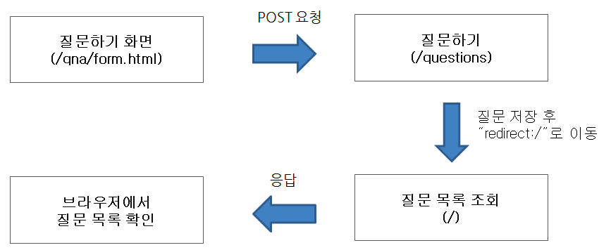
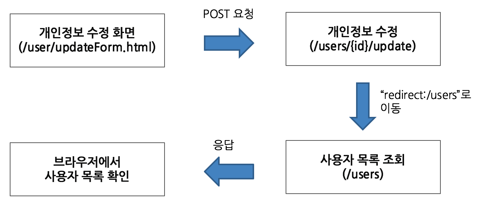

# be-w34-spring-cafe
## 스프링 카페 1-1 단계
### 회원가입, 사용자 목록 기능 구현
- 카페 깃헙 저장소를 기반으로 실습을 진행한다.
- Lucas 브랜치 생성 기능이 오류날 경우 깃헙 저장소에서 직접 브랜치를 생성한다. (현재 미리 생성되어 있음)
- 요구사항에 대한 구현을 완료한 후 자신의 github 아이디에 해당하는 브랜치에 Pull Request를 통해 리뷰 요청을 한다.

### 회원가입 기능 구현

- 회원하기 페이지는 static/user/form.html을 사용한다.
- static에 있는 html을 templates로 이동한다.
- 사용자 관리 기능 구현을 담당할 UserController 클래스를 추가하고 애노테이션 매핑한다.
- @Controller 애노테이션 추가
- 회원가입하기 요청(POST 요청)을 처리할 메소드를 추가하고 매핑한다.
- @PostMapping 추가하고 URL 매핑한다.
- 사용자가 전달한 값을 User 클래스를 생성해 저장한다.
- 회원가입할 때 전달한 값을 저장할 수 있는 필드를 생성한 후 setter와 getter 메소드를 생성한다.
- 사용자 목록을 관리하는 ArrayList를 생성한 후 앞에서 생성한 User 인스턴스를 ArrayList에 저장한다.
- 사용자 추가를 완료한 후 사용자 목록 페이지("redirect:/users")로 이동한다.

### 회원목록 기능 구현

- 회원목록 페이지는 static/user/list.html을 사용한다.
- static에 있는 html을 templates로 이동한다.
- Controller 클래스는 회원가입하기 과정에서 추가한 UserController를 그대로 사용한다.
- 회원목록 요청(GET 요청)을 처리할 메소드를 추가하고 매핑한다.
- @GetMapping을 추가하고 URL 매핑한다.
- Model을 메소드의 인자로 받은 후 Model에 사용자 목록을 users라는 이름으로 전달한다.
- 사용자 목록을 user/list.html로 전달하기 위해 메소드 반환 값을 "user/list"로 한다.
- user/list.html 에서 사용자 목록을 출력한다.
- user/list.html 에서 사용자 목록 전체를 조회하는 방법은 다음과 같다.

### 회원 프로필 조회

- 회원 프로필 보기 페이지는 static/user/profile.html을 사용한다.
- static에 있는 html을 templates로 이동한다.
- 앞 단계의 사용자 목록 html인 user/list.html 파일에 닉네임을 클릭하면 프로필 페이지로 이동하도록 한다.
- html에서 페이지 이동은 <a /> 태그를 이용해 가능하다.
- <a href="/users/{{userId}}" />와 같이 구현한다.
- Controller 클래스는 앞 단계에서 사용한 UserController를 그대로 사용한다.
- 회원프로필 요청(GET 요청)을 처리할 메소드를 추가하고 매핑한다.
- @GetMapping을 추가하고 URL 매핑한다.
- URL은 "/users/{userId}"와 같이 매핑한다.
- URL을 통해 전달한 사용자 아이디 값은 @PathVariable 애노테이션을 활용해 전달 받을 수 있다.
- ArrayList에 저장되어 있는 사용자 중 사용자 아이디와 일치하는 User 데이터를 Model에 저장한다.
- user/profile.html 에서는 Controller에서 전달한 User 데이터를 활용해 사용자 정보를 출력한다.

### 구현 내용
Spring + mustache 템플릿 엔진을 사용하여 MVC 디자인패턴으로 설계
- controller
  - UserController - 회원가입, 유저 정보 관련 컨트롤러 역할 수행
- model
  - domain
    - User
    - UserCreationDTO - 컨트롤러에서 서비스까지 데이터 전달 역할 수행
  - repository
    - 현재 DB 대신 메모리에 유저 정보를 저장하고 있는 상태
    - 추후 DB 연결 작업 수행 예정 -> 추후 변경이 쉽도록 인터페이스로 구현
  - service
    - User 클래스를 조작하는 서비스 로직 수행
- util
  - Encrypt -> 비밀번호 해싱 작업 수행

## 스프링 카페 1-2 단계
### 글쓰기 및 글 목록 기능 구현
- 사용자는 게시글을 작성할 수 있어야 한다.
- 
- 게시글 페이지는 static/qna/form.html을 수정해서 사용한다.
- static에 있는 html을 templates로 이동한다.
- 게시글 기능 구현을 담당할 ArticleController를 추가하고 애노테이션 매핑한다.
- 게시글 작성 요청(POST 요청)을 처리할 메소드를 추가하고 매핑한다.
- 사용자가 전달한 값을 Article 클래스를 생성해 저장한다.
- 게시글 목록을 관리하는 ArrayList를 생성한 후 앞에서 생성한 Article 인스턴스를 ArrayList에 저장한다.
- 게시글 추가를 완료한 후 메인 페이지(“redirect:/”)로 이동한다.

### 글 목록 요구사항
- 모든 사용자는 게시글을 볼 수 있어야 한다.
- 메인 페이지(요청 URL이 “/”)를 담당하는 Controller의 method에서 게시글 목록을 조회한다.
- 조회한 게시글 목록을 Model에 저장한 후 View에 전달한다. 게시글 목록은 앞의 게시글 작성 단계에서 생성한 ArrayList를 그대로 전달한다.
- View에서 Model을 통해 전달한 게시글 목록을 출력한다.
   - 게시글 목록을 구현하는 과정은 사용자 목록을 구현하는 html 코드를 참고한다.

### 게시글 상세보기
- 모든 사용자는 게시글 상세 내용을 볼 수 있어야 한다.
- 게시글 목록(qna/list.html)의 제목을 클릭했을 때 게시글 상세 페이지에 접속할 수 있도록 한다.
- 게시글 상세 페이지 접근 URL은 "/articles/{index}"(예를 들어 첫번째 글은 /articles/1)와 같이 구현한다.
- 게시글 객체에 id 인스턴스 변수를 추가하고 ArrayList에 게시글 객체를 추가할 때 ArrayList.size() + 1을 게시글 객체의 id로 사용한다.
- Controller에 상세 페이지 접근 method를 추가하고 URL은 /articles/{index}로 매핑한다.
- ArrayList에서 index - 1 해당하는 데이터를 조회한 후 Model에 저장해 /qna/show.html에 전달한다.
- /qna/show.html에서는 Controller에서 전달한 데이터를 활용해 html을 생성한다.

### (선택미션) 회원정보 수정
### 요구사항
- 회원 목록에서 회원가입한 사용자의 정보를 수정할 수 있어야 한다.
- 비밀번호, 이름, 이메일만 수정할 수 있으며, 사용자 아이디는 수정할 수 없다.
- 비밀번호가 일치하는 경우에만 수정 가능하다.
- 회원가입한 사용자 정보를 수정할 수 있는 수정 화면과 사용자가 수정한 값을 업데이트할 수 있는 기능을 나누어 개발해야 한다.
- 사용자 정보를 수정하는 화면 구현 과정은 다음과 같다.
- 
- 

### 구현 내용
- 리뷰 내용 반영
  - Service와 domain 분리
    - 기존에 domain에서 수행하던 pw 암호화 로직을 service로 옮김
    - 테스트 코드 일부 변경 (메서드 명 변경, 동일 유저 확인 로직 변경)
  - 템플릿 엔진으로 렌더링하는 html 파일들과 리다이렉트에 사용되는 url을 각각 View, Url 이라는 상수 클래스로 관리
- 1-1단계 코드 수정
  - 기존에 Controller에서 수행하던 입력값 유효성 검사를 Controller에서는 입력값이 들어왔는지 여부만, 값 유효성 검사는 Service에서 수행하도록 변경
  - 기존에 생성자에서 초기화 시켜주던 멤버변수들을 @Autowired 어노테이션을 이용하여 의존성 주입하도록 변경
  - 예외 처리 및 예외 핸들링 코드 추가
  - encrypt 방식 변경
- 1-2단계 요구사항 구현
  - 글쓰기, 읽기 기능 구현 -> User와 Article을 동일한 구조로 설계
  - 유저 정보 수정 기능 구현

## 스프링 카페 1-3 단계 - DB 연동
### 기능 요구사항
- 사용자 데이터를 DB에 저장 (Spring JDBC 사용, ORM 사용X)
- 게시글 데이터를 DB에 저장 및 조회 (전체 게시글 목록, 게시글 상세페이지)
- 회원정보 수정 및 DB에 저장

## 스프링 카페 2-1 단계 - 로그인 기능 구현, 개인정보 수정
### 기능 요구사항
- 로그인이 가능해야 한다.
- 현재 상태가 로그인 상태이면 상단 메뉴가 “로그아웃”, “개인정보수정”이 나타나야 하며, 로그아웃 상태이면 상단 메뉴가 “로그인”, “회원가입”이 나타나야 한다.
- 로그인한 사용자는 자신의 정보를 수정할 수 있어야 한다.
- 이름, 이메일만 수정할 수 있으며, 사용자 아이디는 수정할 수 없다.
- 비밀번호가 일치하는 경우에만 수정 가능하다.

### 1-3, 2-1 구현 내용
1. DB 연동
   - 기존 메모리에 정보 저장 -> Spring jdbc를 사용 h2 db에 저장
   - User와 Article 각각 Repository interface 구현체 클래스 생성(JdbcUserRepository, JdbcArticleRepository)
2. 로그인 기능 구현
   - 세션을 이용하여 로그인 기능 구현
     - 세션에는 유저 id 값만 저장
   - 로그인이 필요한 서비스에 커스텀 마커 어노테이션 @SessionIdRequired 를 사용하여 접근 권한 체크
     - 권한 체크 및 예외 처리는 AOP를 사용, aop.Aspects.class 에서 수행
     - 로그인 되어있지 않을 시 로그인이 필요하다는 문구를 모델에 담아 로그인 페이지로 리다이렉트 시켜줌

### 구현 필요 사항
- 테스트 코드가 하나도 없음! 테스트 코드 작성 필요

## 스프링 카페 2-2 단계
### 기능 요구사항
- 로그인하지 않은 사용자는 게시글의 목록만 볼 수 있다.
- 로그인한 사용자만 게시글의 세부내용을 볼 수 있다.
- 로그인한 사용자만 게시글을 작성할 수 있다.
- 로그인한 사용자는 자신의 글을 수정 및 삭제할 수 있다.

### 구현 요구사항
- 데이터베이스를 MySQL로 변경한다.
- 서버에 MySQL을 설치하는 경험을 해 본다.
- 프로젝트 구성은 필요에 따라 로컬 설치, 도커를 통한 설치, 서버에 설치 중 편한 방법을 선택해서 연동한다.

### 구현 내용
1. 권한 인증 방법 변경
   - 로그인을 체크하는데 AOP보다 Interceptor를 사용하는 것이 더 적절한 방법이라고 생각되어 변경
   - /users/* 과 /articles/* 로 매핑되는 메서드들 중 @SessionIdRequired 어노테이션이 붙은 메서드에서만 인터셉트 수행
2. jdbcTemplate을 사용하여 테이블에 insert 및 update를 수행했을 때, keyholer를 사용하여 id값을 리턴하도록 수정
3. 게시글 업데이트, 삭제 기능 구현
4. 각각의 메서드에서 수행하던 예외 처리를 ControllerAdvice 를 사용하여 처리
5. DB 로컬 H2 -> Krane mysql 연결
   - H2 미사용으로 SpringJdbcConfig 클래스 삭제

### 구현 필요 사항
1. 테스트코드는 2-3까지 구현 후 작성 예정!
